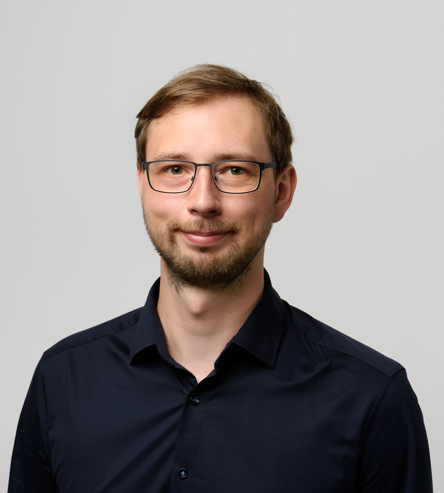

# Welcome to My Website

My name is **Dennis Gräfe**, and I am a **Software Developer** based in **Erfurt**. I am driven by a desire to explore the full spectrum of software engineering, a journey that has led me to leverage a broad spectrum of technologies to build efficient, scalable solutions.

## 📖 About Me

My interest in technology and computer science began early, leading me to complete my initial training as a **State-Certified Technical Assistant for Computer Science**.

My academic path started in **Computer Science**, but seeking a deeper connection to practical applications, I transitioned to **Electrical Engineering and Information Technology**. This shift allowed me to tackle real-world technical challenges head-on. Ultimately, this experience reaffirmed my core ambition: to build high-quality software as a professional developer.

Years of tackling high-pressure development projects have sharpened my technical expertise and honed my ability to deliver under pressure. I pride myself on being a quick study and a disciplined, reliable developer who brings a proactive approach to every stage of the software lifecycle.

---

## ⚙️ Key Software Projects

### 🌐 Modern Web Infrastructure & Identity Management

- **RESTful Backend Systems:** Engineered robust backends using **Laravel**, focusing on high-performance data flow and structured RESTful API design.
- **Identity & Security:** Implemented secure **OAuth2** authentication flows, integrating third-party providers such as Apple and Google.
- **Internal Operations:** Developed specialized administrative interfaces using **Laravel Nova** and managed full-cycle server maintenance for production environments.

### 📊 Network Visualization & Analytical Tools

- **Graph-Based Network Mapping:** Developed a **C# / .NET WPF** application to graphically represent complex network topologies (switches, routers, and physical cabling).
- **Bandwidth Logic:** Programmed the underlying algorithms to calculate and visualize bandwidth capacity and data load across the entire system.
- **Cloud Module Development:** Created custom business modules using **TypeScript**, **JavaScript**, and **Bootstrap** to extend enterprise cloud functionality.

### 🏭 Industrial Automation & Core Architecture

- **Machine Control Workflows:** Collaborated with **PLC (SPS) engineers** to develop software orchestrating machine workflows and hardware interfacing via custom APIs.
- **Universal Architecture:** Designed a modular base architecture used as the primary engine for multiple distinct software products, ensuring code reusability.
- **Automation Tooling:** Developed a custom **code generation tool** to automate repetitive development tasks and reduce manual error rates.

### 🗺️ Geospatial Systems & Public Sector Solutions

- **Utility Infrastructure Management:** Built specialized software using **ArcGIS Engine (C#)** for the digital mapping and management of water supply networks.
- **Governmental Process Databases:** Developed a database-driven system for the **Erfurt Environmental Government office** to manage complex regulatory and environmental processes.
- **Spatial Data Engineering:** Engineered tools to read and process diverse geospatial datasets for urban and environmental analysis.

---

## 🛠 Technical Expertise

| Category                | Technologies                                           |
| :---------------------- | :----------------------------------------------------- |
| **Languages**           | C++, C#, Java, PHP, JavaScript, TypeScript, SQL        |
| **Frameworks**          | Laravel, .NET, WPF, Spring Boot, React, MFC, Bootstrap |
| **Tools & Environment** | ArcGIS Engine, Redis, OAuth2, ZOHO, SmartGit, Redmine  |
| **Human Languages**     | German (Native), English (Business Fluent)             |
